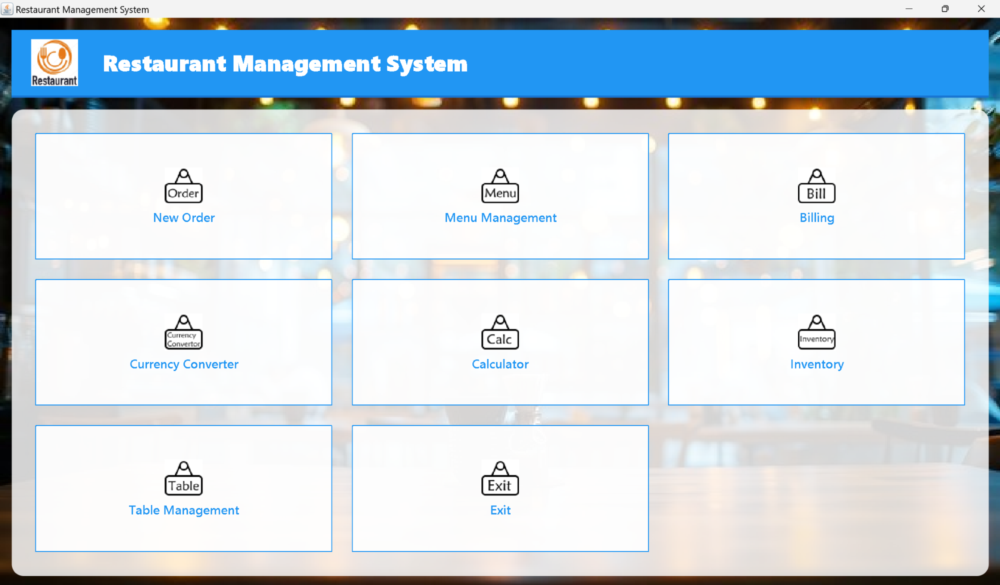
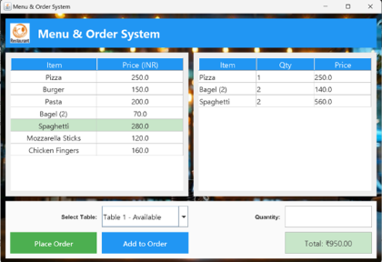
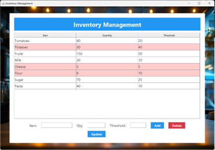
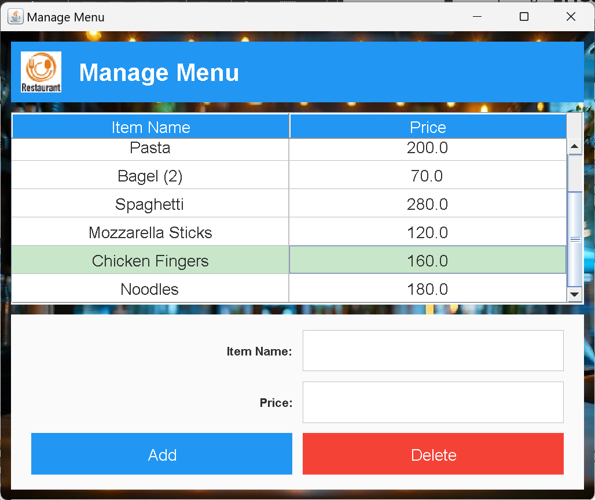
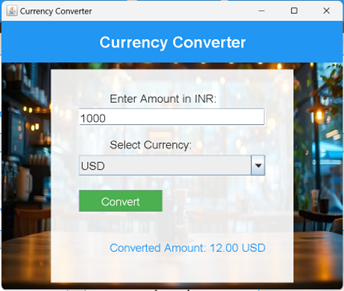
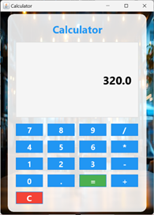
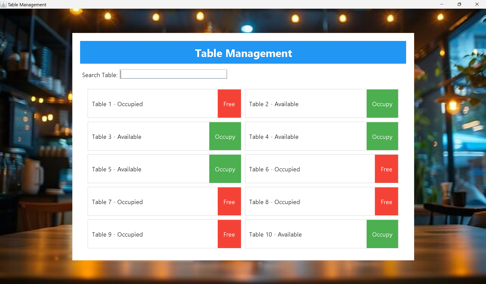

# 🍽️ Table Tango: Restaurant Management System


A user-friendly and efficient Java-based Restaurant Management System built using **Swing** and **MySQL**.  
Perfect for small to medium-sized restaurants to manage menus, orders, inventory, billing, and more.

---

## ✨ Features

- 🧾 Real-time Order Management with bill generation  
- 🍔 Menu Management (Add / Edit / Delete Items)  
- 📦 Inventory Management Module with stock alerts  
- 🧮 Built-in Modern Calculator  
- 💱 Integrated Currency Converter  
- 🪑 Table Allocation & Real-Time Tracking  
- 📜 PDF-based Printable Bill Receipts  
- 🔒 Secure JDBC Connectivity via Properties File  
- ⏱️ Responsive Java Swing UI  
- ⚙️ Modular, clean, and extensible architecture  

---

## 🖥️ Tech Stack

- **Frontend**: Java Swing  
- **Backend**: Java  
- **Database**: MySQL  
- **IDE**: IntelliJ IDEA  
- **Connector**: JDBC  

---

## 🛠️ Setup Instructions

### 1. Clone the Repository
```bash
git clone https://github.com/yourusername/RestaurantManagementSystem.git
cd RestaurantManagementSystem
```

### 2. MySQL Setup
Create the database and required tables:

```sql
CREATE DATABASE restaurant_db;

USE restaurant_db;

CREATE TABLE menu (
    id INT AUTO_INCREMENT PRIMARY KEY,
    item_name VARCHAR(255),
    price DOUBLE
);

CREATE TABLE orders (
    id INT AUTO_INCREMENT PRIMARY KEY,
    item_name VARCHAR(255),
    quantity INT,
    item_total DOUBLE
);

CREATE TABLE inventory (
    id INT AUTO_INCREMENT PRIMARY KEY,
    item_name VARCHAR(255),
    stock INT
);
```

### 3. Update Database Credentials

Edit `dbconfig.properties` and update your credentials:

```properties
url = jdbc:mysql://localhost:3306/restaurant_db
user = your_username
password = your_password
```

### 4. Run the Project

- Open the project in **IntelliJ IDEA** (or any Java IDE)  
- Run `MainFrame.java`

---

## 📸 Screenshots

- 🖼️ *Main Dashboard*  
  

- 🖼️ *Order Management*  
  

- 🖼️ *Bill Receipt*  
  

- 🖼️ *Inventory Management*  
  

- 🖼️ *Menu Management*  
  

- 🖼️ *Currency Converter*  
  

- 🖼️ *Calculator*  
  

- 🖼️ *Table Management*  
  


---

## 👨‍💻 Author

**Sanjay Kumar R**  
Bachelor of Engineering (B.E.) in Computer Science Engineering (2024 - 2027)  
Email: rsanjaymail@gmail.com  
LinkedIn: [linkedin.com/in/SanjayKumarR20082005/](linkedin.com/in/SanjayKumarR20082005/)  
GitHub: [@sanjayKumarR-404](https://github.com/sanjayKumarR-404)  
